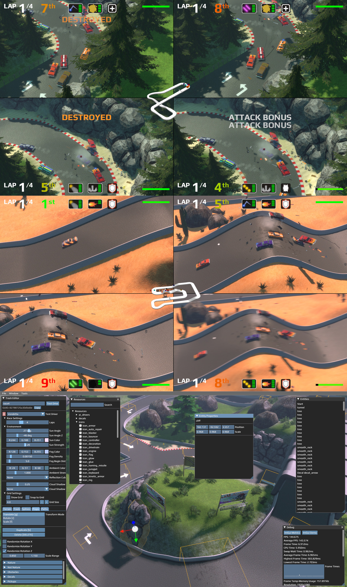

# Racegame (working title)

This repository contains the source code for a racing game that I built in my spare time over the course of several years.
The game is far from finished but it is functional and can be fun to play with friends.
The game is about 33k lines of C++ (according to the `cloc` command). Nothing from the C++ standard template library
is used in order to achieve fast build times and thus fast iteration times (the game builds in less than 9 seconds).
The renderer is built with OpenGL.
Vehicle physics are built with the PhysX library. The game also has an editor for building tracks, environments, and tweaking
vehicle characteristics.

## Technical Details
- Custom OpenGL renderer
- PhysX vehicle simulation
- Custom audio mixer
- Blender exporter for loading meshes into editor
- Splitscreen multiplayer
- Controller and keyboard support
- Track editor (including terrain editor)
- Racing AI
- Championship mode
- Quick race mode
- Vehicle weapons
- Environmental hazards (oil, glue)
- Vehicle upgrades (armor, speed, acceleration, .etc)
- Various graphical effects (SSAO, shadow mapping, lighting, fog, msaa, motion blur)

## Screenshots



## Libraries Used

- Glad (OpenGl loader)
- SDL2 (Input and window management)
- PhysX (Vehicle physics)
- ImGUI (Editor UI)
- STB (OGG vorbis decoding, texture compression)

## Build Instructions

First download the dependencies into the `external` folder.

### Linux

```
make -j4
```

### Windows

The Win32 build requires Python and CMake.
```
python build.py 
```

After building the binary will be located in the `bin` folder.
